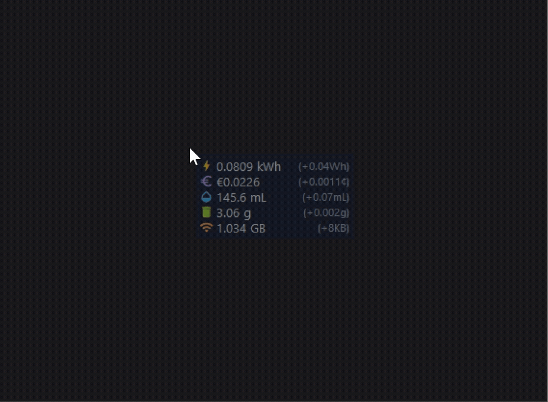

# EcoTracker (에코 트래커)

🌏 **언어 선택 (Language Options)**: [English Version](./README.md)



EcoTracker는 PC의 실시간 자원 사용량을 추적하고, 이를 직접적인 환경적 비용으로 변환하여 실시간 시각화해 주는 크로스 플랫폼 데스크톱 위젯입니다. 마우스 포인터 옆에 투명하게 따라다니거나 화면 모퉁이에 고정되어 작업 및 게임 중 컴퓨터가 환경에 미치는 실시간 영향도를 자연스럽게 인지하도록 돕습니다.

---

## 목차 (Table of Contents)
* [주요 기능](#주요-기능)
* [자원별 상세 계산 공식 및 변환 계수](#자원별-상세-계산-공식-및-변환-계수)
  * [1. 에너지 소비량](#1-에너지-소비량)
  * [2. 누적 전기 요금](#2-누적-전기-요금)
  * [3. 수자원 영향](#3-수자원-영향)
  * [4. 고형 폐기물 & E-Waste](#4-고형-폐기물--e-waste)
  * [5. 네트워크 데이터 사용량](#5-네트워크-데이터-사용량)
* [설치 및 시작 방법](#설치-및-시작-방법)
* [단일 독립 실행 파일 (.exe / .app) 빌드](#단일-독립-실행-파일-exe--app-빌드)
* [프로젝트 폴더 구조](#프로젝트-폴더-구조)

---

## 주요 기능

1. **실시간 소비 전력 측정 (Watts)**
   - CPU 사용량 및 주파수 스케일링, GPU 로드율(GPUtil 기반), RAM의 고정 소비 전력을 종합하여 현재 PC가 소모하는 실시간 전력(W)을 계산합니다.
   - Windows 환경에서는 WMI API를 통해 현재 CPU 모델명을 분석하여 설계 전력(TDP)을 자동으로 인지 및 조절합니다.
2. **실시간 환경 영향 지표 시각화**
   - 누적 에너지 소비량, 실시간 전기 요금 누계, 가상 수자원 소모량, 발전 고형 폐기물, 디바이스 수명 대비 감가상각 e-waste 발생량을 실시간으로 추적합니다.
3. **Geo-IP 기반 위치 및 현지 전기요금 자동 매핑**
   - 시작 시 사용자의 공인 IP를 조회하여 접속 국가를 자동 파악하고, 26개국 전력 요금 데이터베이스에서 현지 화폐 기호와 평균 주거용 전력 요금 요율을 자동으로 적용합니다.
4. **9개 국어 다국어 번역 및 화폐 현지화**
   - 영어, 한국어, 독일어, 스페인어, 프랑스어, 일본어, 중국어, 포르투갈어, 베트남어를 완벽 지원합니다. 시스템 트레이 메뉴의 명칭과 화폐명이 설정 언어에 맞춰 실시간 변환됩니다.
5. **트레이 제어 패널**
   - 작업 표시줄 아이콘을 우클릭하여 위젯 표시 토글, 화면 모퉁이 고정(상하좌우), 자동 감지/수동 화폐 설정 변경 및 언어 설정을 손쉽게 제어할 수 있습니다.

---

## 자원별 상세 계산 공식 및 변환 계수

EcoTracker는 다음과 같은 수학적 수식과 학계 표준 계수를 사용하여 각 환경 지표를 산출합니다.

### 1. 에너지 소비량 ($E_{\text{total}}$)
$$
E_{\text{total}} = E_{\text{hardware}} + E_{\text{network}}
$$

* **하드웨어 전력 ($P_{\text{hw}}$)**: $P_{\text{hw}} = P_{\text{cpu}} + P_{\text{gpu}} + P_{\text{ram}}$
  - **CPU 소비 전력 ($P_{\text{cpu}}$)**: $P_{\text{cpu}} = P_{\text{idle}} + \left(\frac{U_{\text{cpu}}}{100}\right) \times (TDP - P_{\text{idle}})$
    - $P_{\text{idle}}$: CPU 기본 대기 전력 (8.0W 고정).
    - $U_{\text{cpu}}$: 실시간 CPU 사용량 ($0\% - 100\%$).
    - $TDP$: 열설계전력 (Windows WMI API를 통해 모델별로 자동 감지하거나 45W 기본값으로 설정).
  - **GPU 소비 전력 ($P_{\text{gpu}}$)**: GPU 기본 대기 전력 (5W) + 로드율 기반 TDP 스케일링 (외장 GPU 탑재 시 GPUtil로 실시간 샘플링).
  - **RAM 소비 전력 ($P_{\text{ram}}$)**: DDR4/DDR5 메모리 평균 전력 (3.0W 고정).
* **네트워크 인프라 에너지 ($E_{\text{network}}$)**: $E_{\text{network}} = D_{\text{net}} \times 0.06 \text{ kWh/GB}$
  - $D_{\text{net}}$: 누적 네트워크 데이터 사용량 (GB).
  - $0.06\text{ kWh/GB}$: 통신망 라우터 및 데이터 센터 전송 전력 계수 (출처: 국제에너지기구(IEA) / Shift Project).

---

### 2. 누적 전기 요금 ($\text{Cost}$)
$$
\text{Cost} = E_{\text{total}} \times \text{Rate}_{\text{local}}
$$

* $\text{Rate}_{\text{local}}$: kWh당 전력 요율. IP 위치 감지로 파악된 국가 정보 또는 수동 선택한 통화에 맞추어 `tracker/rates.json`에서 자동 로딩 (예: 한국 150.0 원/kWh, 미국 \$0.17/kWh, 독일 0.38 유로/kWh).

---

### 3. 수자원 영향 ($W$)
$$
W = E_{\text{total}} \times 1.8 \text{ L/kWh}
$$

* $1.8\text{ L/kWh}$: 발전소(화력/가스/원자력)의 열 냉각을 위해 소모/증발되는 냉각수 계수 (출처: 전 세계 발전 냉각수 평균 소모량).

---

### 4. 고형 폐기물 & E-Waste ($M_{\text{waste}}$)
$$
M_{\text{waste}} = M_{\text{power}} + M_{\text{e-waste}}
$$

* **발전 고형 폐기물 ($M_{\text{power}}$)**: $M_{\text{power}} = E_{\text{total}} \times 35.0 \text{ g/kWh}$
  - $35.0\text{ g/kWh}$: 전력 생산 중 발생하는 석탄재, 슬래그 등 고형 폐기물 배출량 (출처: EU 전력 그리드 믹스 평균).
* **디바이스 전자폐기물 감가상각 ($M_{\text{e-waste}}$)**: $M_{\text{e-waste}} = \text{Uptime (hours)} \times 0.17 \text{ g/h}$
  - $0.17\text{ g/h}$: 2.0kg 랩톱의 4년 수명(하루 8시간 가동) 기준 시간당 감가상각 중량.

---

### 5. 네트워크 데이터 사용량 ($D_{\text{net}}$)
$$
D_{\text{net}} = \frac{\text{Bytes}_{\text{sent}} + \text{Bytes}_{\text{received}}}{1024^3}
$$

* $\text{Bytes}_{\text{sent}} / \text{Bytes}_{\text{received}}$: 프로그램 시작 이후 송수신된 실제 누적 네트워크 바이트 (`psutil.net_io_counters()` API 기준).

---

## 설치 및 시작 방법

자신의 운영체제(OS)에 맞는 설치 파일 스크립트를 더블클릭하여 실행해 주세요. 스크립트가 필요한 파이썬 라이브러리를 설치하고 앱을 유저 전역 애플리케이션 폴더로 복사한 뒤, 바탕화면 단축아이콘 생성 및 로그인 시 자동 실행 설정을 모두 한 번에 처리합니다.

프로그램을 삭제하려면 각 운영체제에 맞는 언인스톨 스크립트를 실행해 주십시오. 복사된 파일, 바로가기, 그리고 등록된 부팅 시 자동 시작 설정이 깔끔하게 모두 지워집니다.

| 운영체제 (OS) | 설치 파일 | 언인스톨 파일 | 실행 방법 |
| :--- | :--- | :--- | :--- |
| **Windows** | `install.bat` | `uninstall.bat` | 더블클릭하여 실행 (설치 시 Python/pip 필요) |
| **macOS** | `install.command` | `uninstall.command` | Finder에서 마우스 더블클릭으로 실행 |
| **Linux** | `install.sh` | `uninstall.sh` | 터미널에서 실행 |

---

## 단일 독립 실행 파일 (.exe / .app) 빌드

파이썬 환경이 없는 일반 사용자 배포를 위해 커스텀 나뭇잎 아이콘을 내장하여 단일 실행 바이너리로 패키징합니다:

### Windows (.exe)
```bash
python -m PyInstaller --noconsole --onefile --icon=ui/app.ico --add-data "ui/MaterialIcons-Regular.ttf;ui" --add-data "tracker/rates.json;tracker" --name=EcoTracker main.py
```
*(빌드 완료 시 `dist/EcoTracker.exe`에 저장됨)*

### macOS (.app)
```bash
python -m PyInstaller --noconsole --onefile --icon=ui/app.png --add-data "ui/MaterialIcons-Regular.ttf:ui" --add-data "tracker/rates.json:tracker" --name=EcoTracker main.py
```

---

## 프로젝트 폴더 구조

```text
resource_consumption/
├── tracker/
│   ├── rates.json        # 26개국 전력 요금 및 화폐 기호 데이터베이스
│   ├── geo.py            # 공인 IP 기반 비동기 국가 코드 감지 모듈
│   └── engine.py         # 하드웨어 파워 샘플링 및 계수 환산 엔진
├── ui/
│   ├── icons.py          # 구글 메티리얼 나뭇잎 아이콘 로더
│   ├── overlay.py        # 프레임 없는 마우스 추적 투명 Tkinter 위젯
│   └── tray.py           # 9개국 다국어 및 통화 전환 시스템 트레이 데몬
├── config.py             # 오버레이 투명도, 디자인 색상 및 디폴트 TDP 세팅
├── install.bat / .sh     # 윈도우/리눅스용 원클릭 인스톨러 스크립트
└── install.command       # macOS Finder 전용 원클릭 인스톨러 스크립트
```
